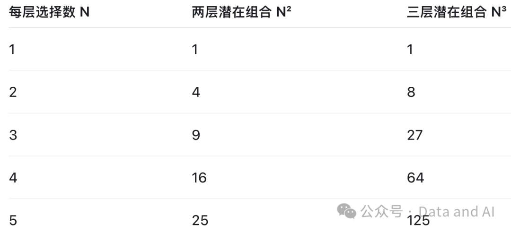
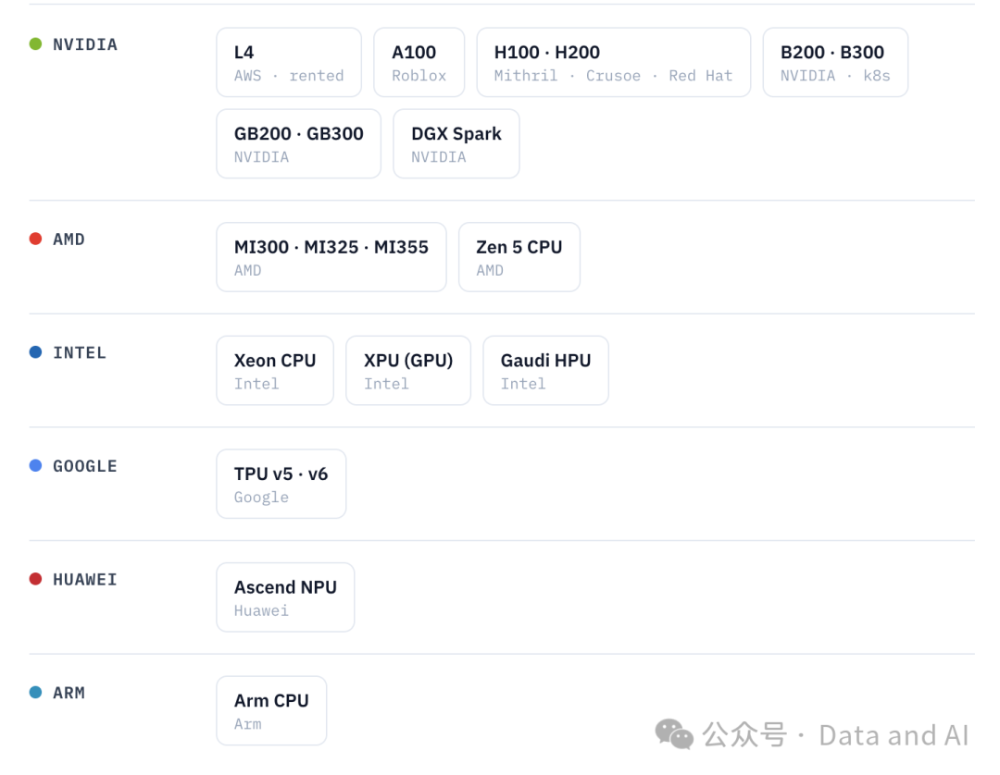

*Common sense is not so common. —— **Voltaire***

通算基础软件的演进过程是一个典型的逐步分层解耦、产品逐步集中的漫长过程。智算基础软件的演进过程应该也会出现类似情况，只不过后者目前还处于白热化竞争阶段，但是其迭代速度很快。本文希望能够从历史中总结经验，为迎接未来的智算基础软件做好准备。

一、通算软硬件分层和组合带来的复杂性

以处理器为例，服务器 CPU 曾经有很多种，经过激烈的市场竞争，目前占主流地位的只剩下 x86、ARM 等少数几种。每多一种 CPU 架构就会带来上层软件巨大的适配成本，而且降低规模效益。在云计算领域，这种情况更为明显，一个数据中心如果要为多种异构硬件做支持，复杂度会显著上升。服务器、存储、网络等硬件莫不如此。

以操作系统为例，服务器操作系统曾经也有很多种，现在竞争只剩下王者 Linux、以及微软的 Windows Server 等少数几种产品。每多一种操作系统也会带来上层软件巨大的适配成本，而且降低规模效益。桌面操作系统还剩Windows、macOS等少数几个。手机操作系统的玩家也只有 iOS、Android 等少数几家。

以数据库系统为例，事务型数据库曾经也有一堆玩家，现在只剩下 Oracle、SQL Server 等少数几家闭源产品，MySQL、Postgres 等少数几家开源软件，以及云计算领域的 Spanner、Aurora 等。相比操作系统，数据库离应用更近，离硬件更远，所以它的产品种类和数量相对而言要更加繁盛。但是，在每个细分领域占据主导地位的也只有少数几个产品。

在不同组件均可自由组合且需要全部支持的极端假设下，处理器、操作系统和数据库分别有 C、O、D 种时，潜在运行环境的上限为 C × O × D。实际支持范围通常只是其中一个子集，而且应用未必需要针对每种组合修改代码；但在部署、测试、认证和运维环节，底层差异仍然会转化为额外成本。当然，应用一般离处理器和操作系统比较远，离数据库更近，大部分开发类适配工作都跟数据库密切相关。这也是为什么数据库系统是最先背锅的基础软件!

很明显，如果每一层都有三个以上的主流产品，必然会带来总体成本的快速增长，极大降低规模效应。然而，从分散供应链风险的角度看，大型企业选型时，每一层都绑定到单一产品也不合算。所以，实际的组合数仍然很容易超过十种。

实际上，上述的每种产品都存在很多变种或者型号。例如 ARM 处理器授权了很多厂商，它们的产品存在一定的区别；Linux 存在很多不同的发行版，它们之间存在很多细节的差异；MySQL、Postgres 的发行版和衍生版则更多，而且它们之间的差异更大。所以，实际应用中要面对的产品组合兼容适配工作更为麻烦。而且，越是细微的改动，越难以在测试验证环节被覆盖。

从创新的角度看，做一款独立的处理器、操作系统、数据库或其他产品明显比做一款发行版或衍生版要更具挑战，要获得的投资和要承担的风险也都相应更大。而做一款发行版或衍生版则相对显得没有难度，从而很容易造成同质化、低水平竞争，也就是🦐卷。

从工程的角度看，大部分企业不会糊涂到认为自己可以搞定处理器、操作系统、数据库等所有一切，都自产自销、自给自足。但是，如果市场上每种产品的同质化竞争过度，企业客户必然会乐见供应商互相竞争，通过压价、PoC 比拼、驻场服务等措施，获得甲方的最大利益。如果这些同质化竞争的产品核心完全来自开源，企业大客户的技术部门不免要评估，为什么我不自己下场，就像很多互联网大厂都有自己的 Linux、MySQL、Postgres 等的开发和维护团队一样。

所以，创新性强的企业要谋求高风险、高收益，优先争取投资，寻找适合自己的玩法。创新性弱的企业，则不免落入高度同质化竞争的市场中。如何构建自己的独特竞争力，是企业生死攸关的问题。创新性弱的企业，也许只能依靠特许牌照，出卖人力服务，或集成交付获取微薄的利润。

二、智算基础软件有何不同？

智算及其基础软件领域仍然处在白热化竞争的时期。与通算 CPU 对应，智算除了 CPU 之外，更重要的算力是各类 xPU，包括 NVIDIA、AMD、Intel 的 GPU、Google 的 TPU、华为的 NPU 等。操作系统也还是 Linux 为主流。在加速器之上，还存在CUDA、ROCm、XLA、CANN等软件栈；再往上才是PyTorch、JAX等训练计算体系，以及vLLM、SGLang等推理引擎。大模型训练目前以PyTorch生态为主，Google TPU生态则大量使用JAX和Pathways；TensorFlow在传统机器学习和行业应用中仍然重要，但在前沿大模型训练中的影响力已经相对下降。大模型除了美国闭源的几大产品之外，开放权重模型的生态尤其繁茂：DeepSeek、gpt-oss、Kimi、MiniMax、Qwen、GLM、Gemma、Nemotron、Inkling 等不同系列。推理服务除了各家自研的框架，开源主流是vLLM、SGLang等。众所周知，大规模训练主要还是跑在 NVIDIA GPU、Google TPU 等少数主流硬件生态上，要适配一种新类型卡的难度太大了；虽然推理服务适配新卡的难度要低一些，但是也架不住要支持的模型和卡种类繁多。

vLLM 是最流行的开源推理引擎，据vLLM自己披露，其每月pip安装量超过560万，并声称支持1000多种模型架构和600多种加速器类型。如此庞大的理论组合显然无法全部进行同等深度的测试。vLLM的CI系统目前拥有58个硬件运行队列，下图展示了其中大约7个厂商、20种硬件配置；但每晚进行完整性能和准确率评测的，实际上是从中挑选出的17组重点“模型—硬件”配置。这说明，面对庞大的组合空间，工程团队只能根据市场份额、用户规模和风险选择重点配置，而不可能穷举所有组合。

图：vLLM CI覆盖的部分加速器厂商和硬件配置。来源：vLLM Blog，2026年7月16日

如果直接和通算基础软件类比，大模型的训练比较接近数据库系统的设计开发，但是它依赖的软硬件更专用；大模型的推理服务比较接近云计算厂商对各种数据库的服务化，但是推理要给模型做更多的软硬件适配和优化。大模型与数据库的顶级产品都还是大厂闭源的产品略胜一筹；但是开源产品也占有重要地位，甚至有赶上和超越的趋势。通算与智算的共同点，预计是产品最终都会通过分层、标准接口和市场竞争逐步收敛。但智算目前具有三个更加明显的特征：第一，加速器、软件栈、训练框架、推理引擎和模型之间存在更强的跨层耦合；第二，模型和软件版本演进速度更快；第三，兼容性不再只是“能否运行”，还必须同时验证吞吐、延迟、显存占用和输出精度。因此，智算基础软件当前面对的组合复杂性，可能显著高于成熟的通算基础软件。

通算基础软件的发展经验表明，规模效应并不要求市场上只剩下一种产品，但要求每一层最终形成少数主流生态，并建立相对稳定的接口。智算基础软件也可能沿着类似方向演进：硬件厂商短期仍会保持多样性，但软件栈、模型格式、算子接口和服务协议会逐步标准化；企业应用部署时，则会从理论上庞大的组合空间中，选择少数重点配置进行完整验证。因此，真正需要避免的不是多样性本身，而是缺少边界、标准和取舍的无序组合。每增加一种硬件、框架或模型，都必须有人承担适配、测试和长期维护的成本。这并不是复杂的理论，只是容易被技术热潮暂时掩盖的工程常识。
