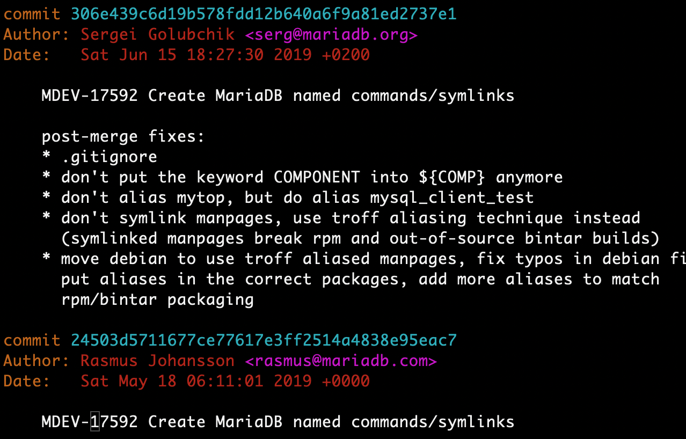

As the title of the blog suggests, this is a collection of random thoughts. Most
of them are on software design, especially on database systems. When there are
friends or students asking questions, I will write down the interesting ones. 

The topics list in reverse chronological order.

# Azure and SAP HANA

<https://azure.microsoft.com/en-us/blog/intel-optane-dc-persistent-memory-azure-netapp-files-and-more-for-sap-hana/>
Intel Optane DC Persistent memory, Azure NetApp Files, and Azure Ultra Disk for SAP HANA
Posted on November 5, 2019

<https://azure.microsoft.com/en-us/blog/azure-sql-data-warehouse-is-now-azure-synapse-analytics/>
Azure SQL Data Warehouse is now Azure Synapse Analytics
cPosted on November 7, 2019

# MariaDB Diverging from MySQL

从 10.4.6 开始，MariaDB 给命令行工具增加了对应的符号链接，例如：mariadb-admin ->
mysqladmin。可以看做是 MariaDB 与 MySQL 正式分道扬镳的开始。 git log:

# CockroachDB Parallel Commit

<https://www.cockroachlabs.com/blog/transaction-pipelining/>
<https://www.cockroachlabs.com/blog/parallel-commits>

1.  它曾经用 OCC，发现有很多事务冲突。也不考虑 SQL 语义，例如 Read Your-own Write，
    做了什么并行 SQL 优化。都被现实狠狠教训了，然后改正。
2.  将 write-intent、提交异步流水线都是比较合乎逻辑的优化，只不过很难彻底消除架构
    设计带来的延迟。把 RocksDB 当做黑盒子使用，只能在存储层的外围去做多版本和分布
    式事务，会多出一些和 RocksDB 的写交互。
3.  把优化跟 Flexible Paxos 扯上关系并且搞了个 TLA+ 的证明。

# Open Source Software Licenses

CockroachDB 本来的协议是 Apache 2.0，从 19.2 开始，要改成 Time-limited Business
Source License (BSL) ，也就是发布三年之后转成 Apache 2.0 协议。它参考了 MariaDB 
的 MaxScale 的 BSL 协议。详细内容参看：

<https://www.cockroachlabs.com/blog/oss-relicensing-cockroachdb/>
<https://www.cockroachlabs.com/docs/v19.2/licensing-faqs.html#what-licenses-does-cockroachdb-use>

开源软件的协议众多，本质上是在理想和现实之间做折衷程度不同的反映。不过最近两年改
协议的案例比较集中，可以说是受 AWS 之类公司刺激太大的必然结果。详细的协议修改情
况如下：

2016-08-15 MariaDB <https://mariadb.com/resources/blog/introducing-maxscale-2-0-beta-release/>
2018-02-28 Elastic <https://www.elastic.co/blog/doubling-down-on-open>
2018-08-22 Redis <https://redislabs.com/blog/redis-license-bsd-will-remain-bsd/>
2018-10-16 MongoDB <https://www.mongodb.com/blog/post/mongodb-now-released-under-the-server-side-public-license>
2018-12-14 Confluent <https://www.confluent.io/blog/license-changes-confluent-platform>
2019-02-21 Redis Again <https://redislabs.com/blog/redis-labs-modules-license-changes/>
2019-06-04 CockroachDB <https://www.cockroachlabs.com/blog/oss-relicensing-cockroachdb/>

那么问题来了，AWS 们怎么办？Fork 一个出来自己玩，重新造个轮子，谈判合作，甚至直
接收购？

# Flexible Paxos

A collection of related blogs and papers: <https://fpaxos.github.io>

包括了论文、博客、代码等。要大致了解论文的内容/结论，可以先看：

论文作者的博客：<http://hh360.user.srcf.net/blog/2016/08/majority-agreement-is-not-necessary/>
Sugu 的博客：<http://ssougou.blogspot.com/2016/08/a-more-flexible-paxos.html>
The Morning Paper: <https://blog.acolyer.org/2016/09/27/flexible-paxos-quorum-intersection-revisited/>

要了解分布式一致性问题的来龙去脉，可以看论文和：

论文作者的 Slides：<http://hh360.user.srcf.net/slides/impossible_consensus.pdf>

总结：

1.  Multi-paxos 为了避免或降低第一个阶段的重复工作，而产生了一个独立的选主阶段。
    实际上，也可以把 Paxos 的第一个阶段当成选主，这样就等于每次都要选主了。归纳
    而言，Paxos 的第一个阶段是选主，第二个阶段是复制。
2.  选主和复制阶段的 Quorum 不要求都是多数派（超过半数的多数派）。而只是要求
    L + P > N，确保选主阶段的 Quorum 与之前复制阶段的有交集即可。这样选择就更多了，
    可以在选主阶段和复制阶段折衷：通常情况下选主发生的机会较少；复制发生的几率更
    大。而且复制阶段的副本数会和延迟正相关，所以增加选主阶段的 L 数，减少复制阶段
    的 P 数，可能是个比较好的选择。
3.  在副本数为偶数个（2n）的时候，原本的 Paxos 要求多数派为 n + 1。FPaxos 可以要
    求选主阶段为 n + 1，但是复制阶段为 n。挂掉一半节点还可以继续运行。不过，如果
    要切主就不行了。

# C++ 20 is coming

<https://herbsutter.com/2019/11/09/trip-report-autumn-iso-c-standards-meeting-belfast/>
<https://www.reddit.com/r/cpp/comments/dtuov8/201911_belfast_iso_c_committee_trip_report/>

# Emoji for Emacs on macOS

Emacs 25.1 删除掉了对 Emoji 的支持，理由是 free systems 还不支持 Emoji。这是个什
么操蛋的理由啊：<http://ergoemacs.org/misc/emacs_macos_emoji.html> Emacs 27 看来又
把这个功能给加回来了：<https://github.crookster.org/emacs27-from-homebrew-on-macos-with-emoji/>
Emacs for macOS 网站暂时还只有 26.3 版本，需要按照这个页面自行 brew 编译安装版本 27。

样本：

1.  🐢、🐰
2.  🐀、🐂、🐅、🐇、🐉、🐍、🐎、🐑、🐒、🐓、🐩、🐖

# Clocks

1.  Scalar logical clock, aka. Lamport Clock
2.  Verctor logical clock
3.  Synchronized clock, such as GPS etc.
4.  Hybrid logical clock

理论说得很复杂，实际上要么弄个彻底的逻辑时钟，例如序号发生器；要么组合逻辑时钟和
物理时钟（HLC），给应用一个按照物理时钟操作和查询数据的机会。存储系统通常只需要
追踪数据的改变，因此大部分时候只需要在写发生的时候才需要去递增时钟。有时为了发心
跳或保持副本之间的时钟同步，可以增加 NOP 操作，也需要递增时钟。

# Funny or Hard Bugs

<https://www.programminginsteeltoecaps.com/my-hardest-bug-to-debug/>

## static variables not thread-safety

旧的 C/C++ 标准和编译器并不保证函数内的 static 变量初始化时的线程安全。曾经遇到
过一个 core dump，分析过所有其他的可能，最后怀疑到了一个 static 变量，但是又无法
精确解释线程如何并发出来当时的现场。最终请教一个专门搞各种疑难场景分析的同事确认
出来了执行的路径。Windows 上也不例外，可以参考 The Old New Thing：

<https://devblogs.microsoft.com/oldnewthing/20040308-00/?p=40363>

## unaligned address causes invalid pthread-mutex

C++ 程序 core dump 后发现 pthread-mutex 的内容明显不对。其中内置的那个 lock
字节尤其不对。讨论发现用了自定义的内存分配器，于是怀疑是内存不对齐导致的问题。经
过确认，出错的地址确实没有对齐，于是检查所有的自定义分配器，该对齐的对齐。

## mismatched integer size

备份模块的代码在遇到某些大于 16TiB 的文件的时候有时会出错，仔细检查了底层的代码，
没有发现问题，但是备份模块的架构师又坚信代码没有问题。后来被同事发现是备份模块传
递的整数大小不匹配，一个是 32 位一个是 64 位。

## unportable code

<https://zedware.github.io/PORTABLE/>

## misleading comments

做原型系统的时候，有个很明显的 Bug，怎么看代码都找不到。最后才发现有行代码的注释
和实际代码的逻辑是反的，之前一直被注释给误导了。

## mini-printer attached to x86 PC

读书的时候有个同学帮教务处做了个小系统，需要用几行汇编代码来驱动一个小打印机。搞
了很长时间都打印不出来，后来发现是他们把参数给传递反了。

## incorrect compare function for qsort

学生做作业经常遇到的问题，比较函数要求返回 < 0, = 0, > 0 分别对应于小于、等于、
大于的情况。对于整数类型，例如 int，很多初学者会简单的用 return (\*a - \*b)，而忽
略了整数减的溢出可能。例如：-2 - 2147483647 = 2147483647。

# Buzzwords Originated from System R

每个行业都有一些特定的行话，计算机领域也不例外。不过，计算机领域还喜欢给一些典型
问题起名字，例如 DB 领域很多人都知道的 Halloween Problem
(<https://en.wikipedia.org/wiki/Halloween_Problem>)。

还有一个跟 System R 有关，但是不太为人所知的 The Convoy Phenomenon
(<https://blog.acolyer.org/2019/07/01/the-convoy-phenomenon/>，
<https://jimgray.azurewebsites.net/papers/Convoy%20Phenomenon%20RJ%202516.pdf>)

# Total order vs. Partial order

简而言之，全序是集合的所有成员都可以排列成队，例如自然数，任意两个成员之间的关系
是小于关系（严格的全序）或小于等于关系（不严格的全序）。按照数学的描述，具备自反
性、传递性、完备性、非对称性。偏序则放松了要求，某些成员之间允许不能比较大小，所
以形成的图不再是一个线性的队列，而是一个有向无环图。按照数学的描述，不再要求完备
性（也就是集合中所有元素都可比）。显然全序比偏序要严格。

<https://www.quora.com/How-can-you-explain-partial-order-and-total-order-in-simple-terms>
<https://en.wikipedia.org/wiki/Total_order>
<http://140.177.205.23/TotallyOrderedSet.html>

# MySQL SQL HINT

SQL HINT 是 DBMS 中比较常见的 SQL 优化手段。无论产品做得多么优秀，都不可能面面
俱到，所以需要在 SQL 语句中加一些特殊的注释来告诉系统怎么做。典型的提示如：告诉
系统按照给定的连接顺序、连接算法去执行。容易发现，不同系统的提示语法很可能不一样，
所以将它们放到注释中是一个比较好的主意，可以在注释中玩出一些花样，而又减小对代码
移植的影响。MySQL 8.0 中大大改进了 HINT 功能，对其分类和语法都做了规范化，又朝
着正规军前进了一步。

# Multiple-thread vs. Multiple-process

DBMS 的进程/线程模型基本上是和 OS 的进程/线程模型同步发展的，因此早期的时候两个
领域的名词用得也不太一样。不知道是研究者们有意为之还是相互之间不太交流同步导致的。
回过头来看，一个系统选择什么样的进程/线程模型，很大程度上受当时主流的硬件平台和
OS 能力的影响。也有少数超前设计的系统，在 OS 还没有准备好多线程的情况下自行实现
了自己的多线程（DB 的人喜欢叫它多线索）。如果是今天，设计一个 DBMS，更多人可能会
选择单进程多线程模型，甚至大量引入协程。

开源社区，尤其是 PG 社区中，经常会有类似的讨论，似乎是每隔一段时间就会来一波。例
如：<https://news.ycombinator.com/item?id=13643911>，
<https://www.postgresql.org/message-id/3647.130.243.12.138.1098892576.squirrel%40130.243.12.138>
等。有些讨论可能就变成口水战了。从设计和应用的角度去看，值得思考的有以下问题：

1.  OS（以及开发语言）对进程、线程、协程的支持程度？
2.  DB 要面对的并发连接数？
3.  开发团队是否具备相关的开发能力？
4.  最终用户是否可以接受？

例如，Windows 用户就很害怕看到系统中有很多同名的占据了大量虚存的进程，以为中了病
毒，技术支持人员就得花费大量精力去解释此类问题。

人大的数据库课程中有专门的章节来介绍和对比各种 DBMS 进程/线程模型，包括函数库模
式的设计（例如 BDB、RocksDB）、单进程多线程的设计（例如 MySQL）、多进程的设计
（例如 PG）等。也讨论了客户端到服务器的连接是一对一的、多对一的、多对多的等各种
形式。Stonebraker 等的“Architecture of a Database
System”（<http://db.cs.berkeley.edu/papers/fntdb07-architecture.pdf>） 的第二章
“Process Models”也有专门的介绍。

# Embarrassingly parallel

不要望文生义，这个 Embarrassingly 在这里类似 Perfect，表示很容易并行化的算法。
Wikipedia（<https://en.wikipedia.org/wiki/Embarrassingly_parallel>) 不仅列出了其他
的说法，也说明了为什么会有这么一个看起来比较奇怪的名字。

# Looking Back at Postgres (Joseph M Hellerstein, 2019)

这是 Michael Stonebraker 获得图灵奖之后的纪念文集（回忆录）中的一篇文章。Joseph
坚持要免费提供下载版本，于是整个图书系列中每一本都有了一章免费的样章。他的博客中
还提到了为什么 Ingres 和 Postgres 的吉祥物是一个乌龟：because ‘it’s slow but it
gets there.’（<https://databeta.wordpress.com/2019/01/09/a-history-of-postgres/>）

这篇文章（<https://arxiv.org/pdf/1901.01973.pdf>） 很有意思，把相关的项目、产品、人
物都联系起来了。DB 领域的人应该都能在里头找到熟悉的人或事情。有意思的细节也有不少，例如：

1.  法国画家 Ingres （安格尔）的作品相信很多人见过。
2.  爱默生的名句"A foolish consistency is the hobgoblin of little minds” 是不是让
    我们对 Consistency 的认识更上层楼？

注：为了能够在 Emacs 里头显示 Emoji，需要做点工作。参看上面的对应小节。Emoji，例
如乌龟直接在输入法中输入即可：🐢。

# The Simplest KV Store

怎么用十行代码实现一个 KV Store？

    $ more kv.sh
    #!/usr/bin/env bash
    # DEMO ONLY
    
    set() {
      echo "Set K=$1 V=$2"
      ln -s $2 $1
    }
    
    del() {
      echo  "Del K=$1"
      unlink $1
    }
    
    get() {
      echo "Get K=$1"
      ls -l $1 | awk '{print $11}'
    }
    
    getAll() {
      echo "Get all"
      ls -l | grep '^l' | awk '{print $9, $10, $11}'
    }

    $ source kv.sh 
    
    $ set BJ Beijing
    Set K=BJ V=Beijing
    
    $ get BJ
    Get K=BJ
    Beijing
    
    $ set SH Shanghai
    Set K=SH V=Shanghai
    
    $ getAll
    Get all
    BJ -> Beijing
    SH -> Shanghai
    
    $ del BJ
    Del K=BJ

# Linux System Performance

经常会有人问到如何分析 Linux 下的性能问题，其实绝大部分都可以通过学习 Brendan
Gregg 的网站解决。所以这才是最应该先去参考的材料。例如他在 LISA2019 的 Slides：
<https://www.slideshare.net/brendangregg/lisa2019-linux-systems-performance>

# DFS vs. DDB

Ceph 说在本地 fs 基础上做分布式 fs 是常见的选择，可是实践上却很受伤。因为：

1.  本地 fs 的事务支持是在太弱，增强它又有很大的额外开销。
2.  本地 fs 臭名昭著的元数据访问性能会拖累整个系统。
3.  本地 fs 对新存储介质的支持进展实在太过于缓慢。

数据库系统，包括分布式数据库系统的设计，早就有过类似的教训。例如：

1.  本地 fs 对 db 的存储/事务子系统不那么友好，除了 PG，很少有系统依赖它。
2.  本地 db 的【分布式】事务能力很弱或开销较大，会拖累整个系统。
3.  本地 db 对新介质的支持也是过于缓慢。

从分层设计和复用的角度看，基于本地 fs/db 设计分布式 fs/db 是一个合理的选择，
这也可以满足快速搭建一个能用可用的系统的需求。但是考虑到整体性能、系统适应性等
因素，把本地 fs 当做黑盒子设计分布式 fs 不总是一个好的设计。同样的，把本地 db
当做一个黑盒子设计分布式 db 也不见得是一个好的设计。如果本地 fs/db 又先天不足
或无法掌握其代码，那就更不是一个好的选择了。

如果说很多分布式 fs 针对的场景跟本地 fs 还有比较大的差异的话，分布式 db 针对的场景
跟本地 db 的差异就没那么大了。例如：某些分布式 fs 是针对大文件或 Append Only 文
件设计的，分布式 db 却不可能只针对大事务或只读事务去做设计。分布式 db 首先要解决
的是分布式事务以及其他的 ACID 问题，需要解决的问题是本地 db 要解决的问题的超集。
分布式 fs 却可以只解决本地 fs 问题的子集。

# PG vs. MySQL

PG 和 MySQL 社区经常会有口水战，理性一点的做法是互相促进、互相学习。大部分人作为
用户，从互为备胎的角度考虑一下，岂不是更好？当然也有人是做开发的，不考虑二者版权
协议的差异，把它们集成到一起，例如把 PG 的存储引擎换成 InnoDB，发挥各自的所长。
甲骨文等公司或社区应该都不会干这种勾当，但是不同产品的互相促进和学习是实实在在发
生的事情。

# MySQL Hash Join

MySQL 8.0 终于实现了 HashJoin，这说明了几个问题：

1.  之前的版本是多么的弱，所以以它为学习模版是有缺陷的，以它为功能参考是容易建立优势的。
2.  它的生态环境的完备可能弥补了功能上的先天不足。
3.  最初设计实现的是一群非专业人士，Sun 的时代没搞好，Oracle 的时代又拖延了时间，现在终于步入正轨了。

<https://mysqlserverteam.com/hash-join-in-mysql-8/>

